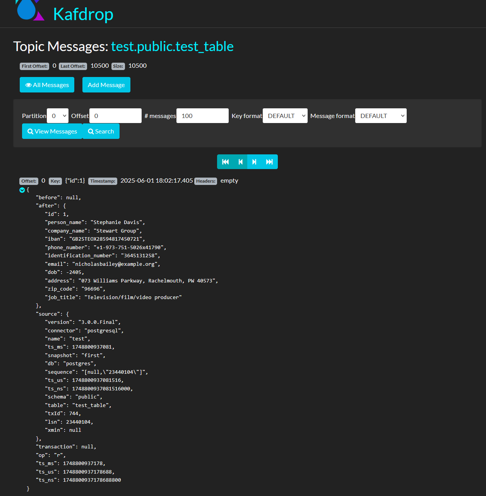
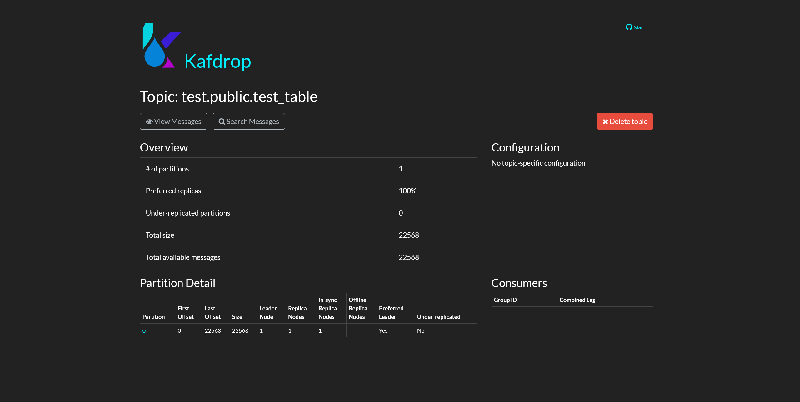

# Example data pipeline using python, Postgres, Debezium and Kafka.
___

Whole thing is prepared to be run on docker, just run `docker compose up` (add `-d` to make it work on background).

Todo List:
- [x] Add a docker compose file
- [x] Add Postgres 15 in docker compose as `db` service
- [x] Data Generation
  - [x] Add a basic, fixed data generation in an `app.py` file
  - [x] Generate a `Dockerfile` of `app.py`
  - [x] Add configuration support from env variables
  - [x] Add connection pooling and connection retry mechanisms
  - [x] Generate data using `Faker` library
  - [x] Add bulk insertion of 500 rows
  - [ ] Add Retry support on insertions
  - [x] Add scheduling, i.e 500 rows insert per minute
  - [x] Add dirty, wrong, misplaced and empty data with configurable occurence chance(%) on data generation
- [x] Add, configure, and prepare Kafka
- [x] Setting up Debezium CDC
  - [x] Update Postgres configuration for Debezium usage (enable wal)
  - [x] Configure Debezium to listen db changes and send kafka events
- [x] Add or configure simple kafka topic listener and see that Debezium is sending datas successfully and correctly to related Kafka topic
- [ ] Stress the system, see the limits of bulk data insertion, Debezium change reading capability and kafka topic durability
- [ ] Consuming Data from Kafka Topic
- [ ] Data cleaning / cleansing
  - [ ] Prepare strategies for the dirty data
  - [ ] Write data cleaning and cleansing
  - [ ] Put the clean / cleansed data to somewhere, i.e. another db table.

After successful `docker compose up` call this curl to register and start debezium connector to get the datas from `test_table`:

```bash
curl -i -X POST http://localhost:8083/connectors \
  -H "Accept:application/json" \
  -H "Content-Type:application/json" \
  --data '{
    "name": "postgres-connector",
    "config": {
      "connector.class": "io.debezium.connector.postgresql.PostgresConnector",
      "plugin.name": "pgoutput",
      "database.hostname": "db",
      "database.port": "5432",
      "database.user": "postgres",
      "database.password": "postgres",
      "database.dbname": "postgres",
      "database.server.name": "dbserver1",
      "table.include.list": "public.test_table",
      "topic.prefix": "test",
      "slot.name": "debezium_slot",
      "publication.name": "dbz_publication",
      "key.converter": "org.apache.kafka.connect.json.JsonConverter",
      "value.converter": "org.apache.kafka.connect.json.JsonConverter",
      "key.converter.schemas.enable": "false",
      "value.converter.schemas.enable": "false",
      "database.history.kafka.bootstrap.servers": "kafka:9092",
      "database.history.kafka.topic": "schema-changes.postgres"
    }
  }'
```

Successful Response:

```
HTTP/1.1 201 Created
Date: Sun, 01 Jun 2025 18:02:16 GMT
Location: http://localhost:8083/connectors/postgres-connector
Content-Type: application/json
Content-Length: 808
Server: Jetty(9.4.54.v20240208)

{"name":"postgres-connector","config":{"connector.class":"io.debezium.connector.postgresql.PostgresConnector","plugin.name":"pgoutput","database.hostname":"db","database.port":"5432","database.user":"postgres","database.password":"postgres","database.dbname":"postgres","database.server.name":"dbserver1","table.include.list":"public.test_table","topic.prefix":"test","slot.name":"debezium_slot","publication.name":"dbz_publication","key.converter":"org.apache.kafka.connect.json.JsonConverter","value.converter":"org.apache.kafka.connect.json.JsonConverter","key.converter.schemas.enable":"false","value.converter.schemas.enable":"false","database.history.kafka.bootstrap.servers":"kafka:9092","database.history.kafka.topic":"schema-changes.postgres","name":"postgres-connector"},"tasks":[],"type":"source"}
```

✅ **Success!** Your Debezium PostgreSQL connector was created correctly.

Here's what just happened:

* **HTTP 201 Created** means the connector is now active.
* It's connected to your `test_table`.
* It'll emit Kafka events with the topic prefix **`test`** (e.g., `test.public.test_table`).
* It uses **pgoutput** and a custom **replication slot** (`debezium_slot`).
* History topic is: **`schema-changes.postgres`**.
* Kafka bootstrap: `kafka:9092`

#### 📬 Check Kafka Topics
Use **Kafdrop** on [http://localhost:9000](http://localhost:9000/topic/test.public.test_table/messages?partition=0&offset=0&count=100&keyFormat=DEFAULT&format=DEFAULT) (if you're running it).


[http://localhost:9000/topic/test.public.test_table](http://localhost:9000/topic/test.public.test_table)
